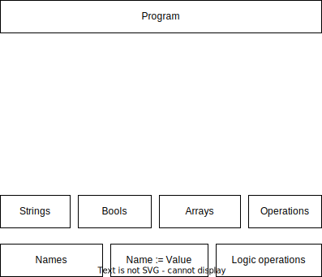

# The Functional Paradigm

## Lesson objectives:

- Thinking about OOP as a design choice.
- Contrasting mathematical functions with software functions.
- The three keys of functional programming:
  1.  Pure functions.
  2.  Immutable data structures.
  3.  Side-effect code bridge.
- λ.

## Object-orientated programming

In OOP we design our code around _classes_ (or objects).
These cluster data and/or processing code into one place.
For good OOP design, we typically create classes for _nouns_ that we encounter when talking about our code in natural language.

E.g.

> The API starts by establishing a connection to a database. It writes to the database when it receives a PUT request.

In this example, there are several nouns which we might use to group our code.
We might have a `WebAPI` class, we probably want a `Database` class -- or maybe even better a `DatabaseConnection` class.

We usually have methods (processing code) that are the verbs we encounter.
In the same example: we might have a `DatabaseConnection::open` method, and probably a `write()` method somewhere.

Here's the **same sentence**, but in Pythonic pseudocode:

```py
class WebAPI:
   def start(self):
      self.db = DatabaseConnection()
      self.db.open()

   def receive_PUT(self, data):
      self.db.write(data)

class DatabaseConnection:
   def open():
      ...

   def write():
      ...
```

Here is a rough mindmap of the concepts of OOP stacked roughly in order of hierarchy:


This is a choice that we have made to lay out our code this way.
We could have made another decision, to write everything into global functions, for instance.

> [!TIP]
> The takehome is that using OOP is a _design choice_.

## The functional paradigm

Functional programming is often said to be a paradigm.
It probably is, but for now, consider it as an alternative to OOP.

Let's think about a redesign of the OOP way of arranging code.



We will keep the types, and primitive things but remove the idea of the object as a _first-class citizen_.
We need some structure to use to organise our code around.
This is going to be the ✨ function ✨.

In software parlance 'function' means something that is _close to_ but not exactly the mathematical definition of 'function'.

#### Side note

We might naturally write some C++ like this:

```c++
/**
 * @brief Does a thing
 *
 * @param [in] someInput value
 * @param [in/out] array a vector of doubles
 */
 void doTheThing(int someInput, std::vector<double> &array)
 {
   for (size_t i=0; i<array.size(); ++i) {
      array[i] *= double(someInput);
   }
   return;
 }
```

And C++ would call that thing "a function".

### A quick refresher of some maths you probably did a long time ago

In formal mathematics:

> A function is a relation between two sets $X$ and $Y$ which assigns each element of its domain, $X$, to one and only one element of codomain $Y$.
>
> $$
> f : X \mapsto Y
> $$

> 
> CC BY-SA 3.0, https://commons.wikimedia.org/w/index.php?curid=20802095

A trivial example (that is not spectacularly instructive):

$$
y = f(x) := x^2; \,\, x\in \mathcal N
$$

relates every natural number to its square.

Another way of defining a function instead of by formulae involving the element is by specifying each relation:

$$
\delta : \mathbb R \mapsto \left\lbrace 0, 1\right\rbrace
$$
$$
\delta(0) := 1
$$
$$
\delta(x) := 0\, \forall x \neq 0
$$

### OK, great but what about coding?

This fundamental math definition of a function has an interesting property:

> A mathematical function assigns to **one and only one** element of the codomain.

I.e. it always gives you back the same thing for a given input.

A function cannot see anything but its domain (input arguments) and cannot do anything but point to an element in the codomain (return something).

- The global program state?
- The time of day that I ran the code?
- Environment variables?
- File I/O?

None of these things should have any effect on the function's output.

Hopefully, you've noticed a slight issue here.

## Cornerstones of functional programming

### Pure functions

The core, "first-class citizen" in functional programming is this _pure_ function.

A function is pure if it takes input and gives output, and has no other effect, nor is affected by anything other than the inputs.

> [!NOTE]
> "Pure" isn't necessarily a good name. Think of it more as a specialisation or restricted definition.

### Immutable data structures

Another restriction we impose on ourselves if we want to be functional:

> All data structures are immutable.

Instead of changing data structures, we should make copies.

Hopefully, you've noticed another issue here.

Pragmatically for these tutorials, since we are working in Python and the aim is to "be more functional" we can simply _treat_ datastructures as immutable.
If we wanted to, we could use an external library, something like [`pyrsistent`](https://github.com/tobgu/pyrsistent/), to give "immutable versions" of all of the standard Python containers.
But for simplicity and readability, we don't do that.

### Side-effect free - side-effectful bridge

Finally, in fully functional programming languages, there needs to be some way to affect change or handle a mutable state.
We've just defined a nice predictable, intelligible set of restrictions.
But pure functions and immutable datastructures don't have a way to _do_ anything.

So there should be some kind of bridge to _having an effect_.

In Haskell this is with an [_actions_ mechanism](https://wiki.haskell.org/Action).
In Clojure this is with [_atoms_](https://clojure.org/reference/atoms), _agents_, and _actions_.

More pragmatically, in Python, we don't really have to worry about this.
Because Python (or Julia) doesn't impose pure functional style.
We can simply separate the concerns: functional code into certain parts of the code, and effectful code into single responsible places.

## λ

In the following examples, we'll be using the λ notation.
This is conventionally used for an _anonymous function_.

In many programming languages, _values_ can be anonymous (not assigned to a name).

```py
print(5)  # 5 is an anonymous value
```

λ is simply a function without a name.
Confusingly, we can also assign a name (in Python, at least).
But the point is, we don't have to.
The Python syntax is:

```py
lambda x: expression
```

So, for example:

```py
square = lambda x: x**2
pow = lambda x, p: x**p
```

Those are equivalent to:

```py
def square(x):
   return x**2

def pow(x, p):
   return x**p
```

Note that these are _good_ examples of λ functions (short, readable) but bad code examples because we've assigned them names.
More sensible use of a λ is as arguments to _higher-order functions_:

```py
squares = map(lambda x: x**2, list)
```
