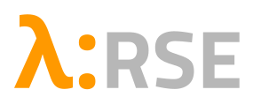

# Functional Programming for RSEs (and friends)

> [!NOTE]
> Initially aimed internally at [ARC](https://ucl.ac.uk/arc) research software engineers and adjacent professions (data scientists, data stewards, ...).

Following the Carpentries nomenclature, this is a lesson (estimated about 0.5 day taught material).
Suggested episode order:

1. [The Functional Paradigm](./01-functional-paradigm.md)
1. [Higher order functions](./02-higher-order.md)
1. [Pattern abstraction]()
1. [Functional problem solving exercises](./04-exercises.md)
1. [Functors, Monads]()
1. [Functional style, tips, and takehomes]()

---

